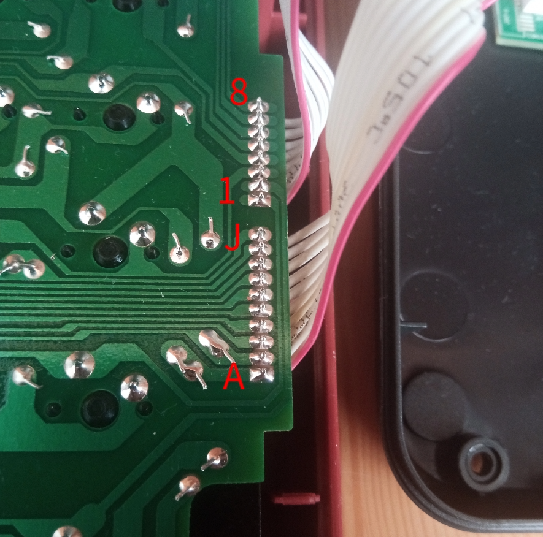
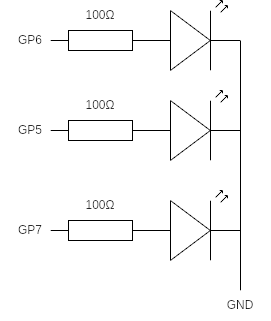

# 使用 YD-RP2040 和 KMK 固件改造S78D键盘

[观看改造视频](https://www.bilibili.com/video/BV1Zv4y1k7F7)

注意：此项目已经停止更新（因为我的 S78D 坏掉了），不保证兼容最新版本的 kmk

## 文件说明

`code/`：code.py 和 boot.py

`keycap/`：键帽夹纸设计

`s78d.jpg`：S78D 键盘板电路接线图

`2023-01-16-225507_1920x1080_scrot.png`：上图出处的截图

`yd-rp2040.png`：YD-RP2040 引脚图

## 接线说明

定义键盘板上触点的编号：按键盘正常摆放的向左旋转 180 度时，从上到下，上方的 8 个触点编号为 8-1，下方的 10 个触点编号为 J-A，如下图所示，锁模块背面自带接口标记



键盘与开发板之间的接线：

```
键盘--开发板
1-----GP15
2-----GP14
3-----GP13
4-----GP12
5-----GP11
6-----GP10
7-----GP9
8-----GP8

A-----GP28
B-----GP27
C-----GP26
D-----GP22
E-----GP21
F-----GP20
G-----GP19
H-----GP18
I-----GP17
J-----GP16

锁模块--开发板
1------GP4
7------GP3
```

使用锁模块的 1、7 号引脚，作为模式切换，当锁转到PRG档时，1, 7 引脚导通，进入可编程模式，可以访问 CIRCUITPY 驱动器和串口，除此之外，进入正常模式，仅可使用键盘功能，但支持 bootkeyboard

注意，RP2040 GPIO 输出电压仅为 3.3V 而非 5V

没有使用自带的 LED 灯板，我另制作了一个，接线如下图。



## 有用的链接

KMK Github 储存库[https://github.com/KMKfw/kmk_firmware](https://github.com/KMKfw/kmk_firmware)

CircuitPython 官网[https://circuitpython.org/](https://circuitpython.org/)

## 有用的提示

### 升级 CircuitPython

参考[https://docs.circuitpython.org/en/latest/shared-bindings/microcontroller/index.html](https://docs.circuitpython.org/en/latest/shared-bindings/microcontroller/index.html)，可以通过进入REPL后执行以下代码重启到UF2模式以便更新CircuitPython

```python
import microcontroller
microcontroller.on_next_reset(microcontroller.RunMode.UF2)
microcontroller.reset()
```

### 重命名 CIRCUITPY 驱动器

参考[https://learn.adafruit.com/welcome-to-circuitpython/renaming-circuitpy](https://learn.adafruit.com/welcome-to-circuitpython/renaming-circuitpy)，用以下内容替换boot.py的内容，然后重启开发板/拔下再插入键盘，然后将boot.py恢复到之前的内容。（可以将KMKFW替换为少于11字符的任意内容）

```python
import storage

storage.remount("/", readonly=False)

m = storage.getmount("/")
m.label = "KMKFW"

storage.remount("/", readonly=True)

storage.enable_usb_drive()
```
